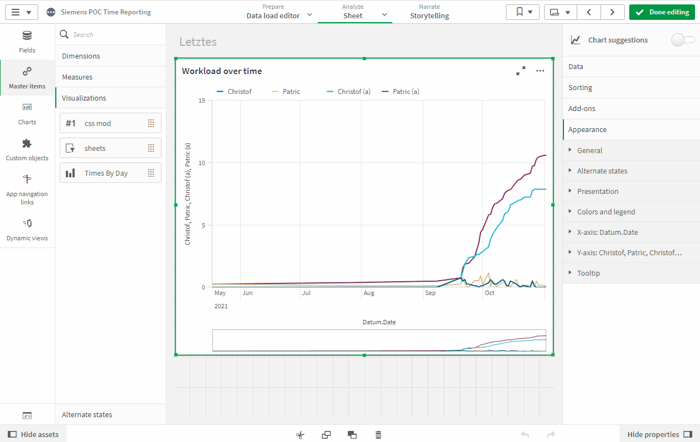

# Master Visualization Changer

Qlik Sense extension, that shows a group of checkboxes for each measure within a chart. The user can show/hide the corresponding
measure in the chart by selecting/deselecting the checkboxes. 

## Approach
Since there is no "conditional show" formula available in the
charts (only in tables and pivots), the only way to achieve this is by copying the properties of a master item, manipulate the
measure list, and using the [Visualization API](https://help.qlik.com/en-US/sense-developer/May2021/Subsystems/APIs/Content/Sense_ClientAPIs/CapabilityAPIs/VisualizationAPI/create-method.htm)  to render it.
